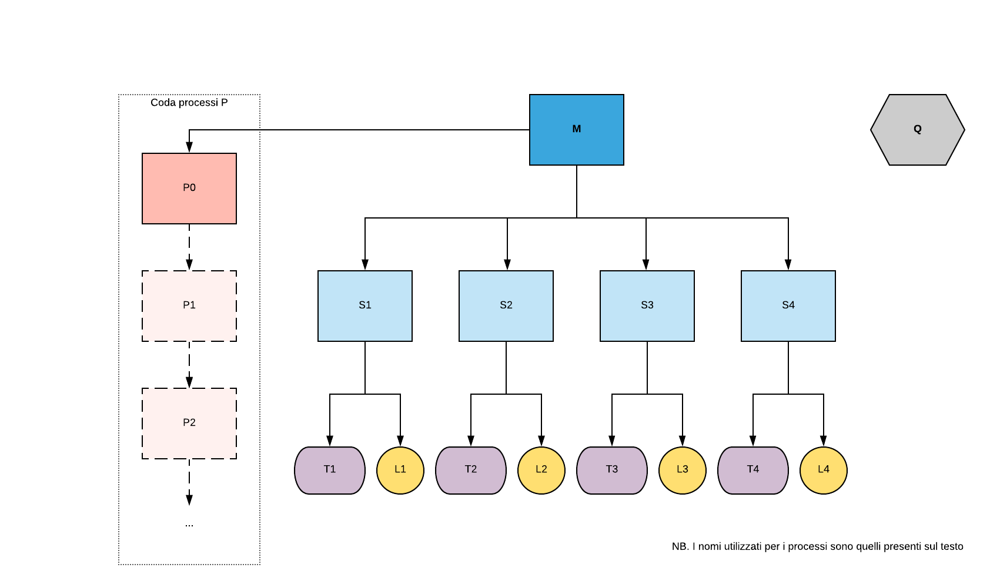

## UNITN-sistemi-operativi-progetto-1-2020

| Nome e cognome     | Mail                                 |
| ------------------ | ------------------------------------ |
| Mattia Paternoster | mattia.paternoster@studenti.unitn.it |
| Francesco Previdi  | francesco.previdi@studenti.unitn.it  |
| Tommaso Manzana    | tommaso.manzana@studenti.unitn.it    |
| Daniele Soprani    | daniele.soprani@studenti.unitn.it    |

_**NB.** C'è anche una versione pdf di questo di file nella cartella principale del progetto._

### Indice

- [Scelte implementative](#scelte-implementative)

  - [Gerarchia processi](#gerarchia-processi)
  - [Metodi di comunicazione tra processi](#metodi-di-comunicazione-tra-processi)
    - [Comunicazione tra _M_ e _S1,S2,S3,S4_](#comunicazione-tra-m-e-s1-s2-s3-s4)
    - [Comunicazione tra _Si_ e _Ti Li_](#comunicazione-tra-si-e-ti-li)
    - [Comunicazione tra _M_ e _Pi_](#comunicazione-tra-m-e-pi)
    - [Comunicazione tra _Q_ e _M_ / _Q_ e _Pi_](#comunicazione-tra-q-e-m-q-e-pi)

- [Difficoltà](#difficoltà)
- [Preparare l'ambiente per il progetto](#preparare-ambiente-per-il-progetto)
  - [Utilizzando il Dockerfile](#utilizzando-il-dockerfile)
  - [Non utilizzando il Dockerfile](#non-utilizzando-il-dockerfile)
- [Testing progetto](#testing-progetto)
  - [Utilizzo programma M](#utilizzo-programma-m)
  - [Utilizzo programma Q](#utilizzo-programma-q)

### Scelte implementative

##### Gerarchia processi

L'albero dei processi è stato creato seguendo la gerarchia rappresentata nello schema seguente:

All'avvio del programma M il processo M si preoccuperà di creare 4 figli (_S1,S2,S3,S4_) i quali a loro volta creeranno 2 figli che rappresenteranno il led e l'interruttore/pulsante. Il primo processo della coda dei processi P sarà figlio di M e sarà creato anch'esso all'avvio del programma.
Il processo M è formato da 4 thread che hanno i seguenti compiti:

1. **Thread 1**: gestione input utente
2. **Thread 2**: legge i messaggi ricevuti dai processi S1,S2,S3,S4
3. **Thread 3**: legge i messaggi ricevuti dai processi P
4. **Thread 4**: legge i messaggi ricevuti da Q

Il programma Q è indipendente da tutti gli altri e non ha alcuna relazione di parentela con gli altri processi.

##### Metodi di comunicazione tra processi

La comunicazione tra i vari processi e programmi è rappresentata in questo schema:

###### Comunicazione tra M e S1 S2 S3 S4

La comunicazione tra M e S avviene utilizzando una pipe anonima in scrittura per ogni processo S, in quanto è necessario un canale di comunicazione esclusivo per ogni S.
In lettura invece è necessaria un'unica pipe in quanto il processo M è l'unico reader.
all'invio di un comando, quindi, M si occuperà di inoltrarlo al corrispondente processo S. Quest'ultimo, invece, avrà il compito di elaborare il comando e inviare il risultato dell'operazione ad M; inoltre si occuperà di informarlo in caso di variazione dello stato di led ed interruttori.

###### Comunicazione tra Si e Ti Li

Per la comunicazione tra S, T e L si utilizzano esclusivamente i segnali.
Una volta ricevuto il comando "premi" da M, S invierà un segnale `SIGURS 1` al relativo pulsante/interruttore T, il quale cambierà il suo stato e risponderà con un segnale `SIGURS 1` di conferma. Ricevuta la conferma S invierà un ulteriore segnale `SIGURS 1` al led L il quale cambierà lo stato e risponderà con un segnale `SIGURS 2` di conferma.

###### Comunicazione tra M e Pi

La comunicazione tra M e P avviene attraverso due pipe anonime (scrittura e lettura) e un segnale `SIGURS 1`.
Quando è necessario creare un nuovo processo P, M scrive sulla pipe l'id del nuovo processo e successivamente invia un segnale `SIGURS 1` all'ultimo P della coda. P legge dalla pipe l'id comunicatogli ed effettua il fork, scrivendo sulla pipe l'id del nuovo processo creato.
M mantiene la coda dei processi P memorizzandone id e pid.
In caso di eliminazione di un processo della coda, verranno inviati dei segnali `SIGTERM` partendo dall'ultimo discendente, risalendo fino al processo selezionato; Successivamente verrà ricreata la coda dei processi.

###### Comunicazione tra Q e M Q e Pi

La comunicazione tra Q e M avviene attraverso due FIFO, una in scrittura e una in lettura.
La comunicazione tra Q e Pi avviene attraverso un segnale `SIGURS 2` (verso Pi) ed una FIFO in lettura.
Sulla base del comando inviato su Q, questo invia una richiesta diversa ad M:

- comando `pos <x>`: Q chiede ad M di inviare il pid corrispondente al processo P in posizione `x` all'interno della coda. M risponde con il pid richiesto.
  Q invia quindi un segnale `SIGURS 2` al P corrispondente al pid ottenuto in precedenza, il quale scrive nella FIFO il proprio id.

- comando `id <y>`: Q chiede ad M il numero di processi P in coda in modo da effettuare una ricerca binaria sull'id. L'algoritmo è spiegato di seguito:
  1. Q parte chiedendo il pid del processo in posizione centrale nella coda;
  2. M risponde con il pid corrispondente;
  3. Q invia quindi un segnale `SIGURS 2` al P corrispondente al pid ottenuto in precedenza, il quale scrive nella FIFO il proprio id;
  4. Q confronta l'id con `y`:
     - se l'id corrisponde, viene restituita la posizione del processo P ricercato;
     - altrimenti prosegue la ricerca binaria. Dovesse non trovare tale id verrà stampato un errore;

### Difficoltà

- Per mancanza di tempo non tutti i possibili casi di errore sono stati gestiti. Alcuni esempi:
  - Nel caso venga killato dall'utente, tramite terminale, un processo utile al funzionamento del progetto non è detto che il programma termini correttamente, gestisca l'errore e non è garantito che continui a funzionare correttamente.
  - Non è stata implementata l'eventualità che vi siano più processi M. Nel caso vi siano più processi M ci sarà un problema di comunicazione tra Q e M_1/M_2.

### Preparare ambiente per il progetto

Nella cartella è presente un Dockerfile con il quale è possibile creare automaticamente l'ambiente per il progetto. Il Dockerfile si occuperà di "costruire" un container Docker nel quale verrà scaricato ed installato Ubuntu 18.04.04, le build-essentials (compilatore gcc e make) e l'editor nano. Una volta costruito l'ambiente, lo script si occuperà di copiare i file necessari all'interno del container. _È possibile testare ed eseguire il progetto anche non utilizzando il file docker._ Seguono alcune indicazioni sull'utilizzo.

##### Utilizzando il Dockerfile

- Aprite un terminale nella cartella del progetto e digitate il seguente comando
  > `docker build --pull --rm -f "Dockerfile" -t labso:latest "."`
- Successivamente per avviare ed entrare nel container creato utilizzare
  > `docker run --rm -it labso:latest`
- Per aprire più terminali collegati allo stesso container
  - Aprire un nuovo terminale
  - Ottenete il _container_id_ utilizzando
    > `docker ps`
  - Successivamente aprite un nuovo terminale con
    > `docker exec -it <container_id> bash`

##### Non utilizzando il Dockerfile

- Semplicemente copiate la cartella `src`, il `makefile` e volendo lo script di comodo `interruttore.sh` all'interno del vostro container docker o macchina virtuale Ubuntu 18.04.

### Testing progetto

1. Entrare nella cartella del progetto e digitare `make build`.
2. Utilizzare
   - `./M` per eseguire il _programma M_
   - `./Q` per eseguire il _programma Q_
3. Per rimuovere gli eseguibili e i file temporanei è possibile utilizzare `make clean`.
4. Utilizzando `make help` verranno mostrate a video alcune indicazioni utili all'utilizzo del progetto.

##### Utilizzo programma M

- Appena avviato il programma sarà richiesto all'utente di specificare il tipo dei 4 dispositivi di input tra interruttore o pulsante.
- Successivamente si sarà liberi di eseguire qualsiasi comando tra quelli proposti.
- Scrivendo `help` in qualsiasi momento durante l'esecuzione di M verranno mostrati a video i comandi disponibili con una breve descrizione. Con essi sarà possibile manipolare gli interruttori/pulsanti, i led, e la coda dei processi P.
- Ogni volta che un led e/o interruttore-pulsante cambia stato sarà fornito un feedback a video. Inoltre utilizzando il comando `status` sarà possibile conoscere in qualsiasi momento lo stato di tutti gli interruttori-pulsanti e led.
- La coda dei processi P verrà manipolata (se possibile) ogni qualvolta venga premuto un pulsante-interruttore e sarà fornito un feedback a video anche in caso di fallimento. Inoltre tramite il comando `list` sarà possibile visualizzare a video la coda dei processi P in qualsiasi momento.
- Sono disponibili alcune funzionalità extra:
  - Tutti i processi hanno un nome diverso e quindi aprendo un altro terminale e utilizzando il comando `ps -a` (il programma M dovrà essere aperto nel terminale principale) sarà possibile visualizzare la situazione corrente dei processi attivi. Utilizzando `ps -a -l | grep P` è possibile visualizzare tutti i processi facenti parte della coda dei processi P.
  - Inviando un `SIGURS1` ad un <ins>interruttore</ins> è possibile cambiarne lo stato. (_es._ il pid del processo `T1_I` è 81; posso aprire un nuovo terminare ed eseguire il comando `kill -10 81` per cambiare lo stato dell'interruttore. Si può facilmente notare che questa è un alternativa all'utilizzo del comando `premi 1`). Utilizzando lo script bash `interruttore.sh <numero_interruttore>` è possibile inviare un `SIGURS1` ad uno dei quattro <ins>interruttori</ins> in maniera più semplice e veloce.

##### Utilizzo programma Q

- Appena avviato il programma verrà mostrato all'utente il menù dei comandi.
- Dopo aver eseguito i comandi `id` o `pos`, nel caso in cui M non sia aperto il programma Q resterà in attesa fino a che M non verrà aperto (c'è la possibilità di chiuderlo utilizzando `CTRL+C`).
